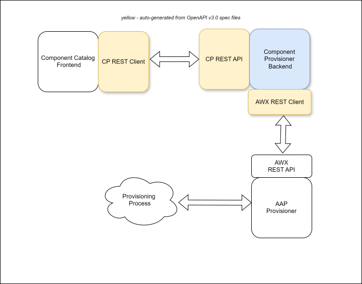
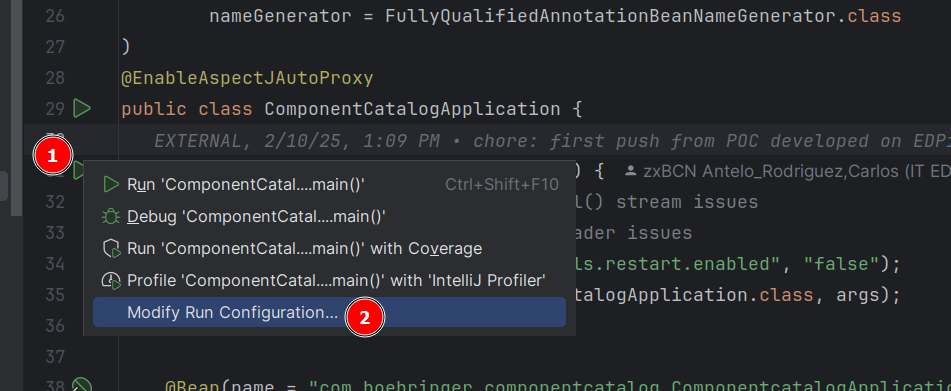
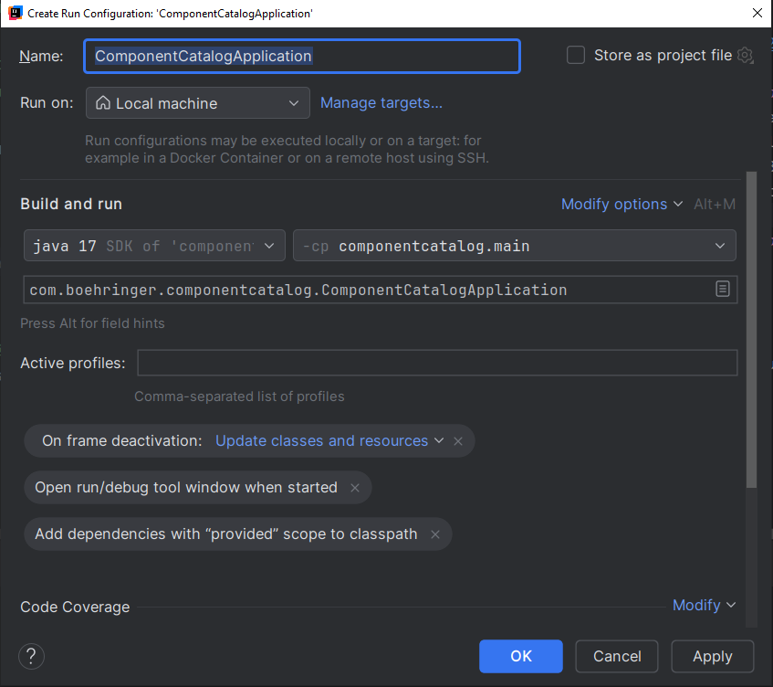
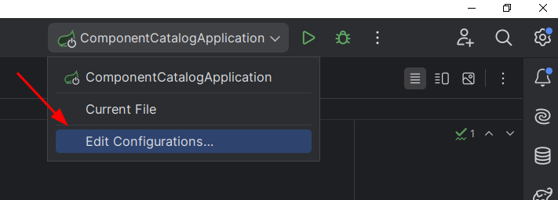
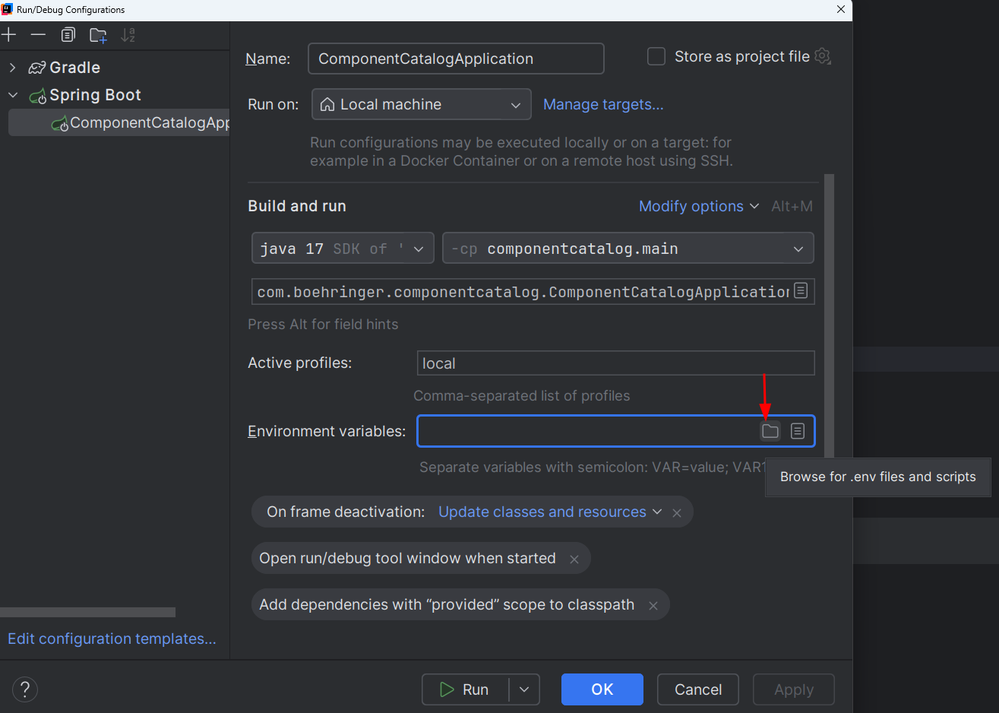
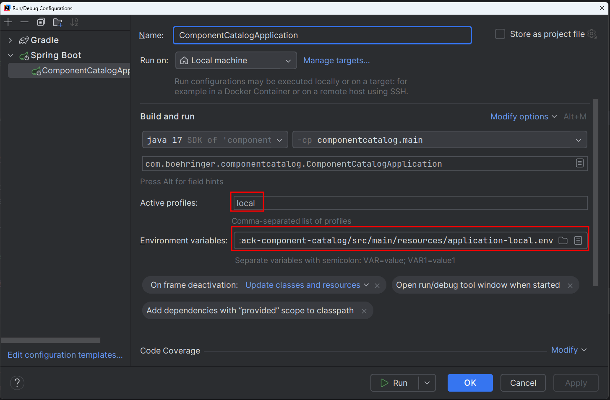

# About

This repository contains the source code for the Component Provisioner backend service. 

**NOTE** Screenshots below are for Component Catalog, but the steps are the same for Component Provisioner.

Also, under the "scripts" directory, the required scripts and OpenAPI specifications required for generating the required API REST clients and server.

The software architecture is as follows:



## GitHub Copilot instructions

This repository includes a `.github/copilot-instructions.md` file that provides GitHub Copilot (and other AI coding assistants) with project-specific guidance. The file covers:

- Project snapshot (Java version, framework, main package, build tool).
- Java style rules observed in this codebase (indentation, imports, line length, naming, etc.).
- Architecture conventions (package boundaries, injection style, DTO separation, error handling).
- API rules (OpenAPI as source of truth, backward compatibility, input validation).
- Common code patterns (Lombok, builders, streams, SLF4J logging).
- Test conventions (JUnit 5, Mockito, AssertJ, `given/when/then` naming, Mother pattern).
- Build and dependency notes.

When working with AI-assisted tooling in this repository, the instructions in that file are automatically picked up. If project conventions change, update `.github/copilot-instructions.md` first so future AI-generated code stays consistent.

## IntelliJ code style and Checkstyle

<!-- Future steps: once the team agrees on a single baseline, we can extend this section with a stricter Checkstyle setup and IDE-specific exports for other editors. -->

Checkstyle is a static analysis tool that checks Java source code against a set of style rules. In practice, it helps keep indentation, imports, wrapping, naming, and brace placement consistent across the team.

This repository keeps an IntelliJ formatting reference in `codeStyles/intellij/codeStyles.xml`. It can be imported into IntelliJ IDEA if needed, but there is no enforced Checkstyle setup yet.

The `codeStyles/` folder is intended to host IDE-specific code style exports in the future too, for example:
- `codeStyles/eclipse/`
- `codeStyles/visualStudio/`

### Import the IntelliJ scheme

- Open the project in IntelliJ IDEA.
- Go to `Settings` / `Preferences` > `Editor` > `Code Style`.
- Click the gear icon next to the current scheme selector.
- Choose `Import Scheme...` > `IntelliJ IDEA code style XML`.
- Select `codeStyles/intellij/codeStyles.xml` from this repository.
- Apply the imported scheme and set it as the current scheme for this project.

If you update the formatting rules later, please update both the XML scheme and this documentation together.

# Local Development Setup - IntelliJ IDEA
For setting up a local development environment, the required steps are:
1. Create a Spring Boot launch configuration
2. Configure the Spring Boot launch configuration
3. Customize the application-local.yml file for local development
4. **(Optional)** Add the required certificates to the JVM truststore

## 1. Create a Spring Boot launch configuration

- Go to the main() method for the application: `org.opendevstack.component_provisioner.ComponentProvisionerApplication.main()`
- Click on its "Play" icon > Modify Run Configuration...
 


- A dialog will appear, click on "Ok" button in order to save the new launch configuration
 


## 2. Configure the Spring Boot launch configuration
This step requires setting the required env variables and the active profile to "local".

### 2.1. Customize env variables for local development
As a preliminary step to get the required env variables with the correct values for local development, 
we will copy-and-modify an env vars template file.

Do the following:
- Copy the template file: 
    - Original: `src/main/resources/application-local.env.template` 
    - Copy: `src/main/resources/application-local.env`
- Customize the copied file with the required values for local development

**NOTES** 
- Files matching the `src/main/resources/*.env` pattern are git-ignored, so they won't be accidentally committed or pushed to the repository.
- Encrypted values are currently **not** supported in the `application-local.env` file.

### 2.2. Modify the Spring Boot launch configuration

Do the following:
- Open the Run/Debug Configuration dialog



- Set the "Active profiles" to just "local" value

- Press Alt+E to enable the "Environment variables" textbox and click on the "Browse for .env files and scripts" icon:


 
- Browse and select the `src/main/resources/application-local.env` you just created

- At the end of the process, you should have a configuration similar to the following:



## 3. Customize application-local.yml file

The `application.yml` file takes some property values from the env vars, and `application-local.yml` config file 
inherits those properties and values from the `application.yml` file. 

This means that no further customization is required regarding those inherited properties and values.

Set other properties in the `application-local.yml` file as needed for local development, e.g. debug level, enabled actuators, local server port, etc.

## 4. Edit secrets in the local Vault server
To do this you will need both the tailor installation and the oc executable.
- For the tailor installation: https://github.com/opendevstack/tailor and follow the README
- For the oc console, download it from the openshift site, click on the question mark next to the user profile link
- Once everything is set, you can run the following command:
  `tailor secrets edit devstack-dev.env.enc --private-key="${ROUTE_TO_folderXYZ}/tailor-private.key" --public-key-dir="${ROUTE_TO_folderXYZ}"`
  notes:
  - press a to enter in insert mode
  - do your updates
  - press esc to exit insert mode
  - type :wq to save and exit

## 5. **(Optional)** Add the required certificates to the JVM truststore
Some HTTPS SSL connectivity issues due to missing SSL certificates can be prevented by adding the required certificates to the JVM truststore.

To do that:
1. Download the required certificates `.cert` file, e.g. get them from a web browser's address bar by clicking on the padlock icon
2. Add the certificates to the JVM truststore by running the following command:
```shell
# Command syntax:
/usr/lib/jvm/java-17-openjdk-amd64/keytool -import -alias <alias> -file <certificate-file> -keystore <path-to-jvm-truststore> -storepass <storepass> 
# Example:
/usr/lib/jvm/java-17-openjdk-amd64/keytool -import -alias us-test -file us-test-certificates.crt -keystore /usr/lib/jvm/java-17-openjdk-amd64/lib/security/cacerts -storepass changeit
```

**NOTES** 
- The certificate should be added to the truststore for the JDK that IntelliJ IDEA uses to *run* the application. 
- The default JVM truststore password is `changeit`

# Quality
[](https://sonarcloud.io/summary/new_code?id=opendevstack_ods-component-provisioner)
[](https://sonarcloud.io/summary/new_code?id=opendevstack_ods-component-provisioner)
[](https://sonarcloud.io/summary/new_code?id=opendevstack_ods-component-provisioner)
[](https://sonarcloud.io/summary/new_code?id=opendevstack_ods-component-provisioner)
[](https://sonarcloud.io/summary/new_code?id=opendevstack_ods-component-provisioner)
[](https://sonarcloud.io/summary/new_code?id=opendevstack_ods-component-provisioner)
[](https://sonarcloud.io/summary/new_code?id=opendevstack_ods-component-provisioner)
[](https://sonarcloud.io/summary/new_code?id=opendevstack_ods-component-provisioner)
